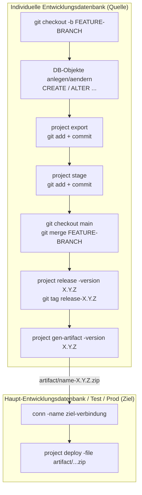

# CI/CD-Vorgehensmodell: Individuelle Entwicklungsdatenbanken und Haupt-Entwicklungsdatenbank

> **Zugehörige Dokumente:** [Konsolidierung nach direkten Änderungen](konsolidierung-nach-direktaenderungen.md) (Ausnahmebehandlung bei Regelverstoß, liefert auch die Diff-Kurations-Technik für Schritt a) unten) · [Entscheidungsvorlage: SQLcl `project`-Tooling](entscheidungsvorlage-sqlcl-project-tooling.md) (warum `stage`/`release`/`deploy` hier aktuell durch einen manuellen Ablauf ersetzt werden, und welche Optionen es gibt)

## Vorgehensmodell (Zielbild)

**Motivation für individuelle Entwicklungsdatenbanken:** Der Wunsch dahinter ist, den Entwicklungsprozess so natürlich wie möglich zu halten – so, wie es bei anderen Programmiersprachen Standard ist und bei uns z. B. in der .NET-/C#-Entwicklung bereits gelebt wird: Jeder Mitarbeiter arbeitet mit einer eigenen, lokal installierten Entwicklungsumgebung, unabhängig von anderen. Für Oracle-Entwicklung bedeutet das übertragen: eine eigene Entwicklungsdatenbank pro Entwickler statt eines gemeinsam genutzten Systems. Diese Motivation steht in Spannung zu dem in der [Grundsatzfrage](#grundsatzfrage-lohnen-sich-individuelle-entwicklungsdatenbanken-noch) weiter unten beschriebenen Rauschen-Problem – beide Seiten sollten beim Abwägen berücksichtigt werden.

Jeder Entwickler arbeitet auf einer eigenen, individuellen Entwicklungsdatenbank (`<INDIVIDUELLE-ENTWICKLUNGSDATENBANK>`). Änderungen laufen ausschließlich über folgenden Weg:

1. Entwicklung und Test auf der individuellen Entwicklungsdatenbank.
2. `project export` nach Git, Commit in einen Feature-Branch (benannt nach dem jeweiligen Jira-Ticket, `<FEATURE-BRANCH>`).
3. Pull Request: Feature-Branch → `main` (da `main` protected ist).
4. Deploy von `main` auf die Haupt-Entwicklungsdatenbank.

**Die tragende Regel:** Keine direkten Änderungen an der Haupt-Entwicklungsdatenbank außerhalb dieses Ablaufs. Jede Änderung nimmt den Weg über die individuelle Entwicklungsdatenbank und Git – die Haupt-Entwicklungsdatenbank wird ausschließlich per Deploy aus `main` verändert.

Wird gegen diese Regel verstoßen, ist [Konsolidierung nach direkten Änderungen an der Haupt-Entwicklungsdatenbank](konsolidierung-nach-direktaenderungen.md) die Ausnahmebehandlung, um Git wieder mit der Realität in Einklang zu bringen – das ist bewusst ein eigenes Dokument, weil es ein Sonderfall ist, kein Teil des normalen Ablaufs.

Solange die Regel eingehalten wird, können mehrere Entwickler völlig unabhängig voneinander arbeiten und mergen – Git regelt das Zusammenführen paralleler Arbeit ganz normal, dafür ist es da. Es muss **nicht** die Entwicklung serialisiert werden, sondern nur sichergestellt sein, dass niemand an der gemeinsamen Datenbank vorbei arbeitet.

## Die vollständige `project`-Befehlskette (Zielbild)

So sähe der Ablauf **technisch** aus, wenn `project stage`/`release`/`gen-artifact`/`deploy` durchgehend nutzbar wären – angelehnt an das offizielle [SQLcl Projects Quick Start](https://docs.oracle.com/en/database/oracle/sql-developer-command-line/26.1/sqcug/quick-start.html) (unsere SQLcl-Version), auf ein Feature statt zwei gekürzt:



**Beispiel-Befehlsfolge** (ein Feature, gekürzt gegenüber der offiziellen Anleitung):

```sql
-- Auf der individuellen Entwicklungsdatenbank:
!git checkout -b <FEATURE-BRANCH>

create table dept (...);
alter table emp add email varchar2(255);

project export
!git add --all
!git commit -m "<TICKET>: DB-Aenderungen exportiert"

project stage
!git add --all
!git commit -m "<TICKET>: dist-Changesets"

!git checkout main
!git merge <FEATURE-BRANCH>

project release -version 1.0.0
!git add --all
!git commit -m "release 1.0.0"
!git tag release-1.0.0

project gen-artifact -version 1.0.0

-- Auf der Zieldatenbank:
conn -name <ziel-verbindung>
project deploy -file artifact/<projektname>-1.0.0.zip
```

Zwei Details, die leicht übersehen werden: `project export` und `project stage` erzeugen jeweils **eigene, separate Commits** (nicht nur einen gemeinsamen). Und `project deploy` bekommt kein Live-Changelog übergeben, sondern eine über `gen-artifact` erzeugte, portable ZIP-Datei – daher das `artifact/`-Verzeichnis, das in unserem Repository schon existiert.

**Aktueller Stand bei uns:** Dieser Ablauf funktioniert derzeit **nicht durchgehend** – `project stage` erzeugt bei unserer Konfiguration (`generatedFormat: "sql"`, bewusst gewählt) keine Ausgabe unter `dist/` (siehe [Entscheidungsvorlage](entscheidungsvorlage-sqlcl-project-tooling.md), Anhang Punkt 4, samt Verweis auf ein bekanntes Oracle-Forum-Problem). Solange das nicht geklärt ist, ersetzen wir die Schritte `project stage` bis `project deploy` durch den manuellen Ablauf im nächsten Abschnitt – der zusätzlich das Prinzip erfüllt, im Fehlerfall nicht ausschließlich auf ein Tool angewiesen zu sein.

## Normaler Ablauf pro Feature

**So setzen wir das Zielbild aktuell praktisch um**, mit manuellem Ersatz für `stage`/`release`/`gen-artifact`/`deploy`: Schritte a)–b) unten entsprechen `project export`, Schritt c) dem optionalen Zwischenstand-Abgleich, Schritt d) dem Merge nach `main` (ersetzt `release`), Schritt e) ersetzt `gen-artifact` + `deploy` durch manuelles, gezieltes Einspielen.

Zwei Anliegen werden hier bewusst getrennt gehalten, die sich leicht vermischen lassen, aber unabhängig voneinander sind:
- **Feature-Entwicklung** (dein eigentlicher Code) – läuft über den Feature-Branch.
- **Umgebungs-Pflege** (deine individuelle Entwicklungsdatenbank mit `main` synchron halten) – läuft unabhängig vom Feature-Branch, direkt gegen einen sauberen `main`-Checkout.

Die Vermischung beider Anliegen (z. B. `main` in den Feature-Branch mergen, nur um die individuelle Entwicklungsdatenbank nachzuziehen) hat sich in der Praxis als Quelle unnötiger Verwirrung erwiesen – siehe [Grundsatzfrage](#grundsatzfrage-lohnen-sich-individuelle-entwicklungsdatenbanken-noch) unten und die Erfahrungen in [Konsolidierung nach direkten Änderungen](konsolidierung-nach-direktaenderungen.md).

### a) Individuelle Entwicklungsdatenbank mit `main` synchron halten

Eigenständige Tätigkeit, unabhängig vom aktuellen Feature-Branch – auf einem sauberen `main`-Checkout, nicht im Feature-Branch:

```powershell
git checkout main
git pull GitHub-Origin main
```

`project export` gegen die individuelle Entwicklungsdatenbank ausführen, gegen diesen `main`-Stand diffen und kuratieren. Für die Kuration (Rauschen von echten Unterschieden trennen) gilt exakt dieselbe Technik wie im Ausnahmefall-Dokument beschrieben – **siehe [dort Abschnitt "Diff kuratieren"](konsolidierung-nach-direktaenderungen.md#3-diff-kuratieren--nicht-blind-übernehmen)**, unabhängig davon, dass es dort im Kontext des Ausnahmefalls steht. Danach die verbleibenden echten Unterschiede auf die individuelle Entwicklungsdatenbank deployen:

- **Reihenfolge einhalten:** neue Tabellen → neue Ref-Constraints (FKs) → geänderte Tabellen → Trigger → Views → ggf. Packages/Prozeduren/Funktionen.
- **Bei geänderten (nicht neuen) Tabellen:** kein `CREATE TABLE` blind drüberlaufen lassen – Oracle kennt kein `CREATE OR REPLACE` für Tabellen. Erst die Struktur-Differenz prüfen, dann gezielte `ALTER TABLE`-Statements schreiben.
- Neue Tabellen, neue Views, neue/geänderte Trigger sind mit `CREATE (OR REPLACE)` unkritisch.
- Danach verifizieren: `project export` wiederholen, gegen `main` diffen – sollte jetzt konvergieren.

> **Unerprobter Diskussionsansatz, noch nicht Teil des empfohlenen Vorgehens:** Denkbar wäre, den Export-und-Diff-Schritt hier künftig ganz auszulassen und stattdessen – wie bei Schritt e) für die Haupt-Entwicklungsdatenbank – die aus Git bekannte Änderungsliste direkt vorwärts einzuspielen, ohne vorherigen Live-Abgleich. Das würde das Rauschen-Problem an dieser Stelle vermutlich vermeiden. Der Ansatz **funktioniert aber nur, wenn die individuelle Entwicklungsdatenbank ausschließlich über diesen Weg verändert wird** – keine vergessenen Ad-hoc-Änderungen, kein Abweichen vom Workflow durch irgendeinen Entwickler. Bricht auch nur einer diese Disziplin einmal, kommt der volle Verifikationsaufwand für den betroffenen Fall wieder ins Spiel – und zwar unbemerkt, bis er auffällt. Ob sich das dauerhaft und zuverlässig durchhalten lässt, ist offen; bis das erprobt ist, bleibt der oben beschriebene, geprüfte Export-und-Diff-Ablauf das empfohlene Vorgehen.

Diesen Schritt bei Bedarf wiederholen (zu Beginn eines Features, und immer wenn `main` währenddessen relevant fortgeschritten ist).

### b) Feature-Branch anlegen und entwickeln

```powershell
git checkout -b <FEATURE-BRANCH> main
```

Entwicklung und Test auf der (jetzt synchronen) individuellen Entwicklungsdatenbank, `project export`, Commit in den Feature-Branch.

### c) Feature-Branch bei Bedarf mit main abgleichen

Falls `main` während der Entwicklung fortgeschritten ist (andere Kollegen haben ihre Features gemerged) und das zu **Code-Konflikten** mit deiner eigenen Arbeit führen könnte:

```powershell
git merge main
```

Das ist eine reine Code-Operation (Textdateien gegen Textdateien in Git), **keine** Live-Datenbank ist dabei im Spiel – entsprechend auch kein Formatierungs-Rauschen zu erwarten. Falls `main` dabei neue DB-Objekte enthält, die deine individuelle Entwicklungsdatenbank noch nicht hat: das ist wieder Schritt a), getrennt von dieser Git-Operation zu behandeln.

### d) Pull Request: Feature-Branch → main

Standard-Merge nach `main`, review wie im Team üblich.

### e) Deploy: main → Haupt-Entwicklungsdatenbank

Ermitteln, was der Feature-Branch zu `main` beigetragen hat:

```powershell
git diff main~1 <FEATURE-BRANCH> --name-only -- src/database/dirkspzm32
```

(`main~1`, weil `main` durch den Merge in Schritt d) jetzt selbst schon den `<FEATURE-BRANCH>`-Stand enthält – als Vergleichsbasis der Stand von **vor** diesem Merge nehmen.) Aus der Ergebnisliste alles unter `mhaberstock/` manuell ausschließen, falls versehentlich mit aufgelistet (privates Schema, nicht für die geteilte DB gedacht).

Deploy in derselben Reihenfolge/Vorsicht wie in a) beschrieben. Nach dem Deploy: Invalidierungs-Kaskade beachten (siehe `dist/utils/recompile.sql`) und wieder per `project export` + Diff verifizieren.

## Grundsatzfrage: Lohnen sich individuelle Entwicklungsdatenbanken noch?

Bei Schritt a) tritt bei jedem Abgleich Formatierungs-Rauschen auf, wenn die individuelle Entwicklungsdatenbank eine andere Oracle-Version als die Haupt-Entwicklungsdatenbank hat. Bei einem konkreten Anwendungsfall (siehe [Konsolidierung nach direkten Änderungen](konsolidierung-nach-direktaenderungen.md#grundsatzfrage-lohnen-sich-individuelle-entwicklungsdatenbanken-noch) für die Rohdaten) waren von 239 zunächst abweichenden Dateien am Ende nur 5 (≈ 2 %) tatsächlich relevant – der Rest war reines Versions-Rauschen.

**Das ist kein Sonderfall, sondern strukturell:** Jedes Mal, wenn Schritt a) läuft – also bei jedem Feature, nicht nur im Ausnahmefall –, entsteht dasselbe Rauschen, weil die individuelle Entwicklungsdatenbank strukturell eine andere Oracle-Version hat als die Haupt-Entwicklungsdatenbank. Der Aufwand skaliert dabei mit der Anzahl der Objekte im Schema, nicht mit der Anzahl echter Änderungen.

Diese Frage ist mit diesem Dokument bewusst **nicht** beantwortet – die automatisierte Kuration macht den Prozess handhabbar, löst aber nicht die zugrundeliegende Ursache. Zwei grundsätzliche Stoßrichtungen wären denkbar und sollten im Team diskutiert werden, bevor individuelle Entwicklungsdatenbanken als dauerhaftes Arbeitsmodell festgeschrieben werden:
- Sicherstellen, dass alle individuellen Entwicklungsdatenbanken dieselbe Oracle-Version wie die Haupt-Entwicklungsdatenbank verwenden (vermeidet die Ursache).
- Die automatisierte Kuration fest in die Tooling-Kette integrieren, sodass sie nicht bei jedem Zyklus manuell ausgeführt werden muss (behandelt das Symptom).
